# VoicePal (Live Text Edition) 🎙️➡️📝

**VoicePal** is a real-time, hands-free translation tool designed for seamless face-to-face conversations.

Unlike traditional translation apps that "speak" back to you, VoicePal focuses on **instant text captioning**. You speak, and the translation appears instantly on the screen for your friend to read. This reduces latency, avoids awkward robot voices, and creates a quieter, more natural interaction.

## 🌟 Key Features
*   **Hands-Free Operation**: No need to hold a button. The app detects when you start and stop speaking.
*   **Instant Text Output**: Translations appear immediately, acting like "subtitles for real life."
*   **Privacy-First**: Audio is processed locally for transcription (Web Speech API) and only text is sent to the cloud for translation.
*   **Zero Audio Output**: Purely visual communication for the receiver.

## 🏗️ Architecture

The system uses a simplified **Input-Process-Display** pipeline:

```mermaid
graph LR
    A[🗣️ User Speech] -->|Web Speech API| B(📝 Transcript)
    B -->|JSON| C{🧠 Google Gemini}
    C -->|Translation| D[📱 UI Display]
```



### Data Flow
1.  **VAD (Voice Activity Detection)**: The browser listens continuously. When it detects speech, it transcribes it to text.
2.  **Silence Trigger**: When the user pauses for **1.5 seconds**, the system marks the sentence as "Complete."
3.  **Translation**: The completed sentence is sent to **Google Gemini**.
4.  **Display**: The translated text is appended to the chat window.

## 🛠️ Tech Stack
*   **Frontend**: React (Vite)
*   **Styling**: Tailwind CSS
*   **Speech Recognition**: Native Web Speech API (`webkitSpeechRecognition`)
*   **Translation Engine**: Google Gemini Pro (`@google/generative-ai`)

## 🚀 Getting Started

### 1. Prerequisites
You only need **one** API key:
*   **Google Gemini API Key**: [Get it here](https://aistudio.google.com/app/apikey)

### 2. Setup Environment
1.  Clone the repository and install dependencies:
    ```bash
    npm install
    ```
2.  Create a `.env` file in the root directory and add your key:
    ```env
    VITE_GEMINI_API_KEY=your_gemini_key_here
    ```

### 3. Run the App
Start the development server:
```bash
npm run dev
```
Open the link (e.g., `http://localhost:5173`) on your phone or laptop.

## 📱 How to Use (Hands-Free)

1.  **Select Mode**:
    *   Tap **"🇺🇸 English Mode"** if you are speaking English.
    *   Tap **"🇻🇳 Vietnamese Mode"** if your friend is speaking Vietnamese.
2.  **Just Talk**:
    *   No need to hold any buttons.
    *   The app will show "Listening..." and a pulsing red indicator.
3.  **Auto-Translation**:
    *   When you stop speaking for **1.5 seconds**, the app automatically detects the silence.
    *   It translates the sentence and displays it on the screen instantly.
    *   It then automatically resumes listening for the next sentence.

## 🛠️ Troubleshooting
*   **"Not Allowed" Error**: Ensure you have granted microphone permissions to the browser.
*   **Stuck on "Listening"**: Try speaking louder or moving closer to the mic. The silence detection waits for a clear pause.
*   **No Translation**: Check your Gemini API key in the `.env` file.
