# VoicePal Architecture & Data Flow

**VoicePal** is a real-time, multi-user translation platform that enables seamless conversations between people speaking different languages. The architecture supports both single-device practice mode and two-user real-time chat via Firebase.

---

## 🏗️ Architecture Modes

### Mode 1: Single-Device (Current - Practice Mode)
A single user practices translation by switching between languages on one device.

### Mode 2: Multi-User Real-Time (Firebase - In Development)
Two users on separate devices communicate in real-time with live translation sync.

---

## 🔄 Multi-User Data Pipeline (Firebase)

```mermaid
sequenceDiagram
    participant UserA as 🗣️ User A (English)
    participant PhoneA as 📱 Phone A
    participant Firebase as 🔥 Firebase Realtime DB
    participant Gemini as 🧠 Google Gemini
    participant PhoneB as 📱 Phone B
    participant UserB as 👂 User B (Vietnamese)

    Note over UserA, UserB: Room Creation & Join
    UserA->>PhoneA: Click "Start Conversation"
    PhoneA->>Firebase: Create room/{roomId}
    PhoneA-->>UserA: Show shareable link
    UserA->>UserB: Share link (SMS/QR/etc)
    UserB->>PhoneB: Click link
    PhoneB->>Firebase: Join room/{roomId}
    Firebase-->>PhoneA: Partner connected
    Firebase-->>PhoneB: Partner connected

    Note over UserA, UserB: Real-Time Translation Flow
    UserA->>PhoneA: Speaks "Hello"
    PhoneA->>PhoneA: Browser STT → Transcript
    PhoneA->>Gemini: Translate to Vietnamese
    Gemini-->>PhoneA: "Xin chào"
    PhoneA->>Firebase: Push message
    Firebase-->>PhoneB: Sync message
    PhoneB->>UserB: Display "Hello" + "Xin chào"

    UserB->>PhoneB: Speaks "Cảm ơn"
    PhoneB->>PhoneB: Browser STT → Transcript
    PhoneB->>Gemini: Translate to English
    Gemini-->>PhoneB: "Thank you"
    PhoneB->>Firebase: Push message
    Firebase-->>PhoneA: Sync message
    PhoneA->>UserA: Display "Cảm ơn" + "Thank you"
```



---

## 🧩 Key Components

### 1. Input Layer: Web Speech API (Zero Latency)
*   **Technology:** Browser's native `webkitSpeechRecognition`
*   **Benefit:** Runs locally with instant transcription
*   **Mode:** Hands-free continuous listening with Voice Activity Detection (VAD)
*   **Trigger:** 1.5-second silence automatically finalizes transcript

### 2. Intelligence Layer: Google Gemini 2.0 Flash
*   **Role:** Context-aware translation engine
*   **Model:** `gemini-2.0-flash-exp` (fastest, latest)
*   **Optimization:** Strict prompt for minimal latency: *"Only return the translated text"*
*   **Languages:** English ↔ Vietnamese

### 3. Sync Layer: Firebase Realtime Database
*   **Purpose:** Real-time message synchronization between devices
*   **Structure:**
    ```json
    {
      "rooms": {
        "{roomId}": {
          "users": {
            "user_a": { "lang": "en", "connected": true },
            "user_b": { "lang": "vi", "connected": true }
          },
          "messages": [
            {
              "id": "msg_001",
              "sender": "user_a",
              "text": "Hello",
              "translation": "Xin chào",
              "timestamp": 1701234567890
            }
          ]
        }
      }
    }
    ```
*   **Authentication:** Anonymous auth (no login required)
*   **Security:** Room-based access control via Firebase rules

### 4. UI Layer: React + Tailwind CSS
*   **Design:** Glassmorphism with smooth animations
*   **Features:**
    - Auto-scroll to latest messages
    - Connection status indicators
    - Shareable link generation with QR codes
    - Language-specific chat bubbles (blue gradient for user, white for partner)

---

## ⏱️ Latency Budget

### Single-Device Mode
| Step | Action | Estimated Time |
| :--- | :--- | :--- |
| 1 | Speech-to-Text (Browser) | ~500ms |
| 2 | Gemini Translation | ~800ms |
| **Total** | **End-to-End** | **~1.3s** |

### Multi-User Mode (Firebase)
| Step | Action | Estimated Time |
| :--- | :--- | :--- |
| 1 | Speech-to-Text (Browser) | ~500ms |
| 2 | Gemini Translation | ~800ms |
| 3 | Firebase Sync | ~100-200ms |
| **Total** | **End-to-End** | **~1.5-2.0s** |

This ~2-second delay is acceptable for natural conversation flow, similar to a "walkie-talkie" style interaction.

---

## 🔐 Security & Privacy

**Firebase Security Rules:**
- Authenticated users only (anonymous auth)
- Room-based access control
- No cross-room data access
- Messages indexed by timestamp for efficient queries

**Data Privacy:**
- No persistent user accounts
- Messages stored temporarily in Firebase
- No audio recording (only text transcripts)
- End-to-end encryption via HTTPS

---

## 🚀 Future Enhancements

### Phase 1: WebRTC Integration
- Add peer-to-peer audio streaming
- Use Firebase for WebRTC signaling
- Keep text sync as fallback
- Enable "HD Voice" mode

### Phase 2: Advanced Features
- Group chat (3+ users)
- Message history persistence
- Language auto-detection
- Offline mode with message queuing
- Video calling with live captions

---

## 📊 Technology Stack

| Layer | Technology | Purpose |
|-------|-----------|---------|
| Frontend | React + Vite | UI framework |
| Styling | Tailwind CSS | Responsive design |
| Speech | Web Speech API | Browser-native STT |
| Translation | Google Gemini 2.0 Flash | AI translation |
| Sync | Firebase Realtime DB | Real-time messaging |
| Auth | Firebase Anonymous Auth | User identification |
| Hosting | Google Cloud Run | Serverless deployment |
| Build | Docker + Nginx | Containerization |

---

## 🎯 Design Principles

1. **Mobile-First:** Optimized for phone screens and touch interactions
2. **Low Latency:** Every component chosen for speed
3. **Reliability:** Firebase provides 99.95% uptime SLA
4. **Simplicity:** No login, no setup - just share a link
5. **Scalability:** Firebase handles 100+ concurrent connections on free tier
6. **Future-Proof:** Architecture supports WebRTC migration
