# VoicePal Architecture & Data Flow

**VoicePal** is designed as a low-latency, mobile-first translation bridge. It prioritizes "Conversation Flow" over complex UI, ensuring that two people can talk naturally despite the language barrier.

## 🔄 The Real-Time Data Pipeline

The application follows a linear, event-driven pipeline for every turn of the conversation.

```mermaid
sequenceDiagram
    participant User as 🗣️ Speaker (English)
    participant App as 📱 VoicePal App
    participant STT as 🎙️ Browser STT (Web Speech API)
    participant Gemini as 🧠 Google Gemini (Translation)
    participant Eleven as 🔊 ElevenLabs (TTS)
    participant Partner as 👂 Listener (Vietnamese)

    Note over User, Partner: Turn 1: English to Vietnamese

    User->>App: Holds "English" Button & Speaks
    App->>STT: Streams Audio Input
    STT-->>App: Returns Transcript ("Hello, how are you?")
    
    App->>Gemini: Send Transcript + Context
    Gemini-->>App: Returns Translation ("Xin chào, bạn khỏe không?")
    
    App->>Eleven: Send Translation text
    Eleven-->>App: Returns Audio Stream (MP3)
    
    App->>Partner: Plays Audio (Vietnamese Voice)
```

## 🧩 Key Components

### 1. Input Layer: Web Speech API (Zero Latency)
*   **Why:** We use the browser's native `webkitSpeechRecognition`.
*   **Benefit:** It runs locally (or via OS optimization), providing instant transcription as you speak. This is faster than uploading audio blobs to a cloud STT service for this specific use case.
*   **Interaction:** "Push-to-Talk" ensures we only capture intended speech, reducing background noise and "hallucinated" translations.

### 2. Intelligence Layer: Google Gemini (Context Aware)
*   **Why:** Translation isn't just word-for-word; it's about intent.
*   **Role:** Gemini receives the text and the *target language*.
*   **Optimization:** We use a strict prompt: *"Only return the translated text, nothing else."* to minimize token usage and latency.

### 3. Output Layer: ElevenLabs (Human Realism)
*   **Why:** To make the conversation feel "real," the voice needs emotion and proper intonation.
*   **Role:** Converts the Vietnamese text into a high-quality audio stream.
*   **Optimization:** We use the `eleven_multilingual_v2` model which is optimized for speed and accent accuracy.

## ⏱️ Latency Budget (Estimated)

| Step | Action | Estimated Time |
| :--- | :--- | :--- |
| 1 | Speech-to-Text (Browser) | ~100ms (Streaming) |
| 2 | Gemini Translation | ~400-800ms |
| 3 | ElevenLabs Generation | ~500-900ms |
| 4 | Network Overhead | ~100ms |
| **Total** | **End-to-End Delay** | **~1.5 - 2.0 Seconds** |

This ~2-second delay is acceptable for a "Walkie-Talkie" style conversation, allowing for a natural pause between speakers.
