# VoicePal Architecture Diagram

This document details the system architecture for **VoicePal (Live Text Edition)**. It is designed to be a living document for future enhancements.

## 🏗️ System Overview

VoicePal operates on a **Client-Serverless** architecture. The heavy lifting of speech recognition happens on the client (Browser), while translation offloads to Google Cloud (Gemini).

### Core Components
1.  **Client (React App)**: Manages UI, State, and Audio Input.
2.  **Web Speech API**: Browser-native engine for Speech-to-Text (STT) and Voice Activity Detection (VAD).
3.  **Google Gemini**: Large Language Model (LLM) acting as the Translation Engine.

## 📊 Mermaid Diagram

Copy the code below into [Mermaid Live Editor](https://mermaid.live/) to visualize and edit.

```mermaid
sequenceDiagram
    autonumber
    participant User as 🗣️ User
    participant Browser as 🌐 Browser (VAD/STT)
    participant App as 📱 React App
    participant Gemini as 🧠 Google Gemini

    Note over User, Browser: Phase 1: Input & Detection
    User->>Browser: Speaks continuously
    Browser->>Browser: Detects Speech (VAD)
    Browser-->>App: Stream Interim Results
    
    Note over User, Browser: Phase 2: Silence Trigger
    User->>Browser: Stops speaking
    Browser->>App: 1.5s Silence Detected
    App->>App: Finalize Transcript
    
    Note over App, Gemini: Phase 3: Translation
    App->>Gemini: POST /generateContent (Transcript + Target Lang)
    Gemini-->>App: Returns Translated Text
    
    Note over App, User: Phase 4: Display
    App->>User: Update UI with Caption
```

### Data Flow Description
1.  **Input**: The user speaks naturally. The browser's `webkitSpeechRecognition` engine listens in the background.
2.  **VAD Trigger**: The app monitors the input. If `interimResults` stop arriving for **1.5 seconds**, the app considers the turn "complete".
3.  **Processing**: The final transcript is sent to Gemini via the `GoogleGenerativeAI` SDK.
4.  **Output**: The response is purely text, which is appended to the message list in the UI.
