# VoicePal Architecture Diagram

This document details the system architecture for **VoicePal** in both single-device and multi-user modes. It is designed to be a living document for future enhancements.

---

## 🏗️ System Overview

VoicePal operates on a **Client-Serverless** architecture with two operational modes:

### Mode 1: Single-Device (Practice Mode)
The heavy lifting of speech recognition happens on the client (Browser), while translation offloads to Google Cloud (Gemini).

### Mode 2: Multi-User (Real-Time Chat)
Two clients sync messages through Firebase Realtime Database, with each device handling its own speech recognition and translation.

---

## 📊 Single-Device Architecture

### Core Components
1.  **Client (React App)**: Manages UI, State, and Audio Input
2.  **Web Speech API**: Browser-native engine for Speech-to-Text (STT) and Voice Activity Detection (VAD)
3.  **Google Gemini**: Large Language Model (LLM) acting as the Translation Engine

### Mermaid Diagram

Copy the code below into [Mermaid Live Editor](https://mermaid.live/) to visualize and edit.

```mermaid
sequenceDiagram
    autonumber
    participant User as 🗣️ User
    participant Browser as 🌐 Browser (VAD/STT)
    participant App as 📱 React App
    participant Gemini as 🧠 Google Gemini

    Note over User, Browser: Phase 1: Input & Detection
    User->>Browser: Speaks continuously
    Browser->>Browser: Detects Speech (VAD)
    Browser-->>App: Stream Interim Results
    
    Note over User, Browser: Phase 2: Silence Trigger
    User->>Browser: Stops speaking
    Browser->>App: 1.5s Silence Detected
    App->>App: Finalize Transcript
    
    Note over App, Gemini: Phase 3: Translation
    App->>Gemini: POST /generateContent (Transcript + Target Lang)
    Gemini-->>App: Returns Translated Text
    
    Note over App, User: Phase 4: Display
    App->>User: Update UI with Caption
```



### Data Flow Description
1.  **Input**: The user speaks naturally. The browser's `webkitSpeechRecognition` engine listens in the background.
2.  **VAD Trigger**: The app monitors the input. If `interimResults` stop arriving for **1.5 seconds**, the app considers the turn "complete".
3.  **Processing**: The final transcript is sent to Gemini via the `GoogleGenerativeAI` SDK.
4.  **Output**: The response is purely text, which is appended to the message list in the UI.

---

## 📊 Multi-User Architecture (Firebase)

### Core Components
1.  **Client A & B (React Apps)**: Independent instances on separate devices
2.  **Firebase Realtime Database**: Central message sync hub
3.  **Firebase Anonymous Auth**: User identification without login
4.  **Web Speech API**: Local STT on each device
5.  **Google Gemini**: Translation on each device

### Mermaid Diagram



```mermaid
graph TB
    subgraph "Phone A - English Speaker"
        A1[🗣️ User A Speaks]
        A2[🎙️ Browser STT]
        A3[📱 React App]
        A4[🧠 Gemini API]
    end

    subgraph "Firebase Cloud"
        FB[(🔥 Realtime Database)]
        AUTH[🔐 Anonymous Auth]
    end

    subgraph "Phone B - Vietnamese Speaker"
        B1[🗣️ User B Speaks]
        B2[🎙️ Browser STT]
        B3[📱 React App]
        B4[🧠 Gemini API]
    end

    A1 --> A2
    A2 --> A3
    A3 --> A4
    A4 --> A3
    A3 <-->|Real-time Sync| FB
    FB <-->|Real-time Sync| B3
    B3 --> B4
    B4 --> B3
    B3 --> B2
    B2 --> B1

    A3 -.->|Authenticate| AUTH
    B3 -.->|Authenticate| AUTH

    style FB fill:#ff9800
    style AUTH fill:#4caf50
```

### Detailed Flow

```mermaid
sequenceDiagram
    participant UA as 👤 User A
    participant PA as 📱 Phone A
    participant FB as 🔥 Firebase
    participant PB as 📱 Phone B
    participant UB as 👤 User B

    Note over UA,UB: 1. Room Setup
    UA->>PA: Create Room
    PA->>FB: POST /rooms/{id}
    PA-->>UA: Share Link
    UA->>UB: Send Link (SMS/QR)
    UB->>PB: Click Link
    PB->>FB: GET /rooms/{id}
    FB-->>PA: Partner Connected ✓
    FB-->>PB: Partner Connected ✓

    Note over UA,UB: 2. Real-Time Conversation
    UA->>PA: Speaks "Hello"
    PA->>PA: STT → "Hello"
    PA->>PA: Gemini → "Xin chào"
    PA->>FB: PUSH message
    FB-->>PB: SYNC message
    PB->>UB: Display "Hello" / "Xin chào"

    UB->>PB: Speaks "Cảm ơn"
    PB->>PB: STT → "Cảm ơn"
    PB->>PB: Gemini → "Thank you"
    PB->>FB: PUSH message
    FB-->>PA: SYNC message
    PA->>UA: Display "Cảm ơn" / "Thank you"
```



### Firebase Data Structure

```json
{
  "rooms": {
    "abc123xyz": {
      "users": {
        "user_1701234567": {
          "lang": "en",
          "connected": true,
          "lastSeen": 1701234567890
        },
        "user_1701234568": {
          "lang": "vi",
          "connected": true,
          "lastSeen": 1701234568123
        }
      },
      "messages": {
        "msg_001": {
          "id": "msg_001",
          "sender": "user_1701234567",
          "text": "Hello",
          "translation": "Xin chào",
          "language": "en",
          "timestamp": 1701234567890
        },
        "msg_002": {
          "id": "msg_002",
          "sender": "user_1701234568",
          "text": "Cảm ơn",
          "translation": "Thank you",
          "language": "vi",
          "timestamp": 1701234568123
        }
      }
    }
  }
}
```

---

## 🔄 Migration Path: Firebase → WebRTC

The current Firebase architecture is designed to support future WebRTC integration:


**Migration Strategy:**
1. **Keep Firebase** for signaling (exchange WebRTC offers/answers)
2. **Keep Firebase** for text backup (if WebRTC connection fails)
3. **Add WebRTC** for low-latency audio streaming
4. **Hybrid Mode** where users can choose text-only or voice mode

---

## 🎯 Key Design Decisions

### Why Firebase over WebSocket Server?
- ✅ No backend code needed
- ✅ Free tier covers hackathon usage
- ✅ Built-in authentication
- ✅ Automatic reconnection handling
- ✅ Works with Cloud Run (static frontend)

### Why Client-Side Translation?
- ✅ Lower latency (no server round-trip)
- ✅ Scales better (each client handles own translation)
- ✅ Simpler architecture
- ❌ Higher API costs (2x Gemini calls vs 1x server-side)

### Why Shareable Links over Room Codes?
- ✅ One-tap join (no typing)
- ✅ Works with QR codes for in-person
- ✅ Native share on mobile
- ✅ Pre-configure language preference

---

## 📈 Scalability Considerations

| Metric | Current Limit | Upgrade Path |
|--------|--------------|--------------|
| Concurrent Rooms | 100 (Firebase free tier) | Upgrade to Blaze plan |
| Messages/Room | Unlimited | Add pagination |
| Message Size | 1 KB avg | Compress large messages |
| Latency | ~1.5s | Migrate to WebRTC |
| Bandwidth | 10 GB/month | Optimize message payloads |

---

## 🔐 Security Architecture


**Security Rules:**
- Anonymous auth required (prevents abuse)
- Room-based access control
- Users can only write to their own user object
- Messages indexed for efficient queries
- No cross-room data access

---

This architecture provides a solid foundation for the hackathon while maintaining flexibility for future enhancements like WebRTC, group chat, and persistent message history.
